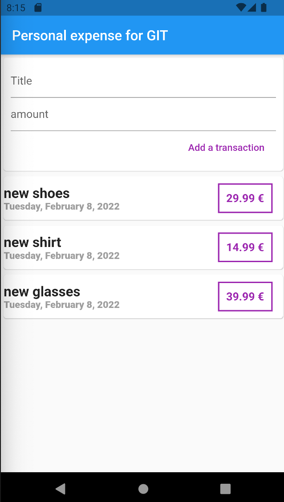

# expenseapp

Personal expense application in Flutter / Application de dépense en Flutter.

## Package used / Paquet utilisés 
Intl package : version 0.17.0 for managing the Date.

## Widgets used / Widgets utilisés
SingleChildScrollView,
Card,
Container,
Text,
TextField (controller method),
FlatButton (possible to update in TextButton / possibilité de mise à jour en TextButton)

NB: 2 possibilities for TextField :
- controller: controller method with TextEditingController;
- onChanged: (value) => variable = value;

